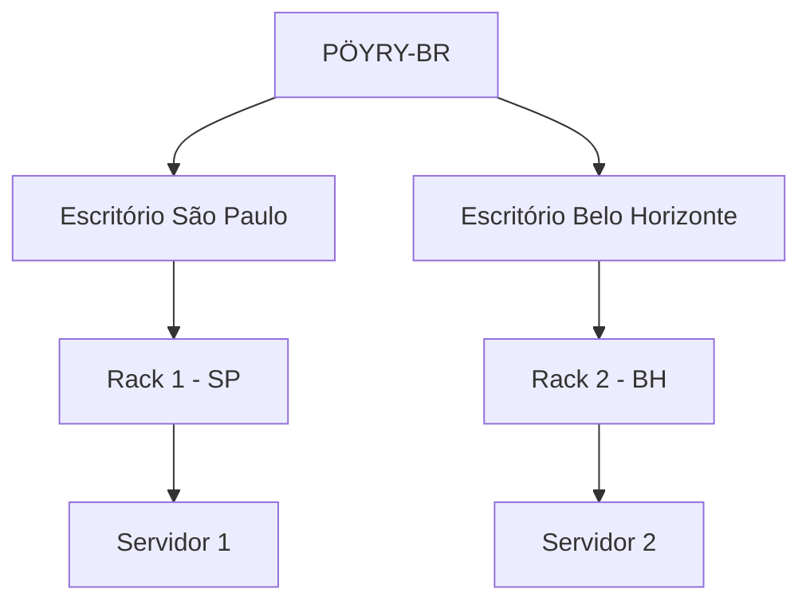

```mermaid
graph TD;
    POYRY[PÖYRY-BR]-->SP[Escritório São Paulo];
    POYRY[PÖYRY-BR]-->BH[Escritório Belo Horizonte];
    SP-->SPR1[Rack 1 - SP];
    BH-->BHR2[Rack 2 - BH];
    SPR1-->SPSERVER1[Servidor 1];
    BHR2-->SPSERVER2[Servidor 2]
```